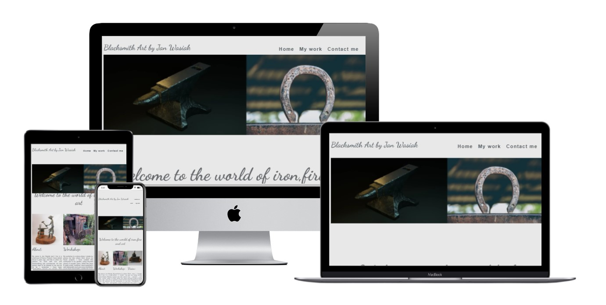
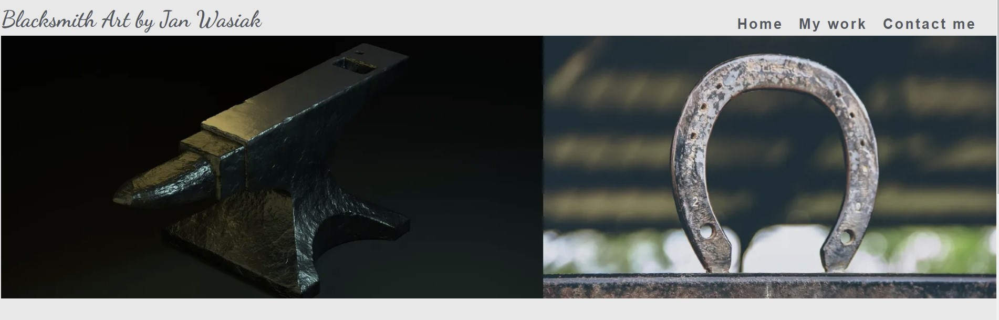
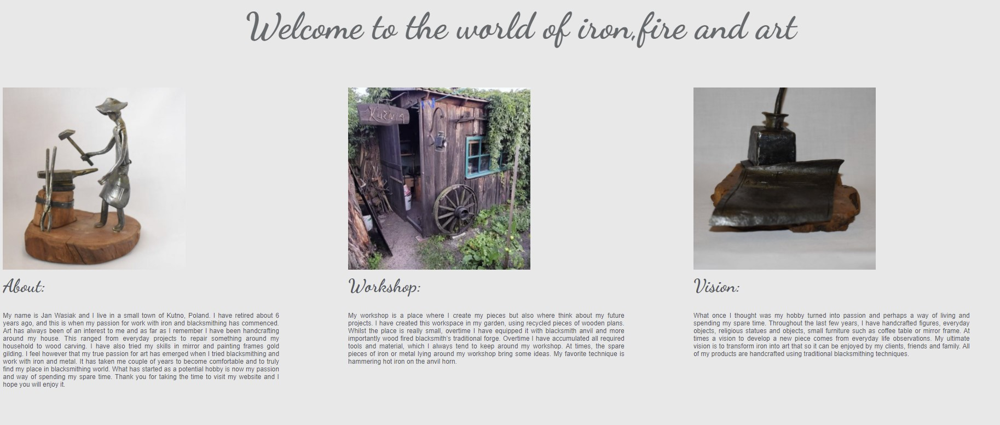
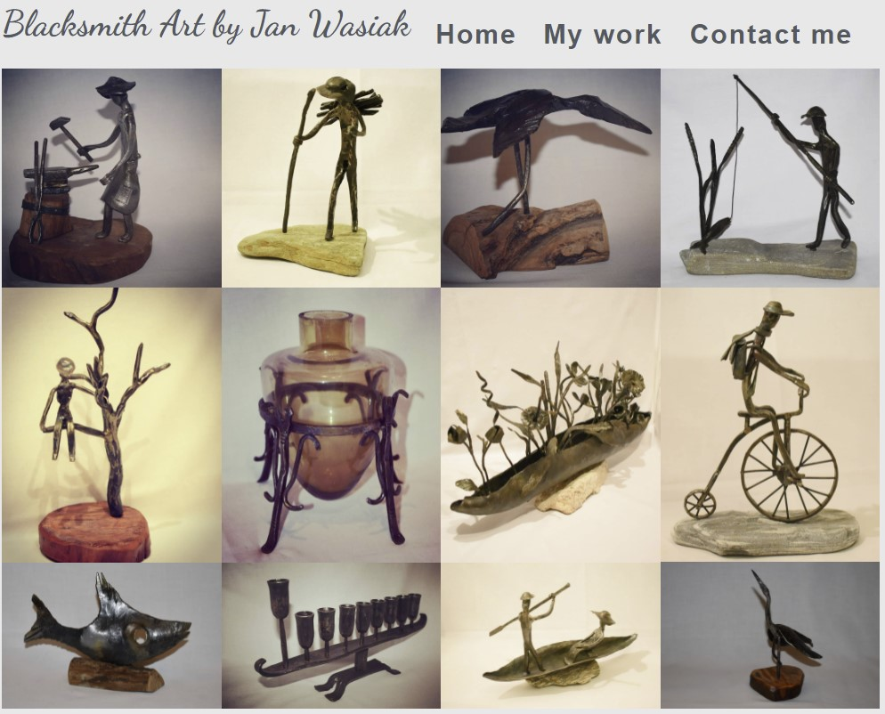
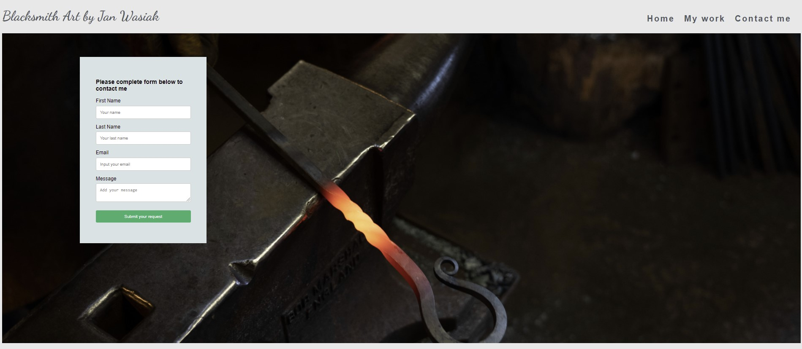
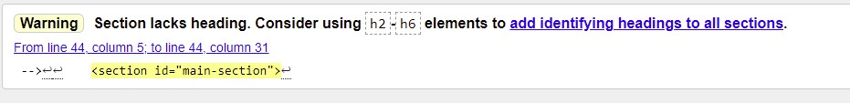
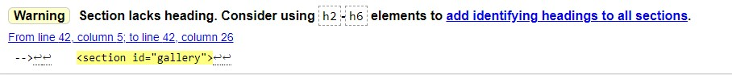
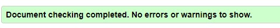
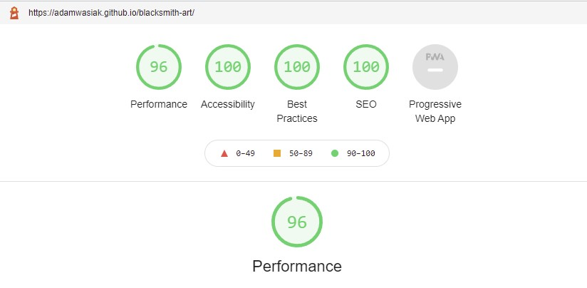
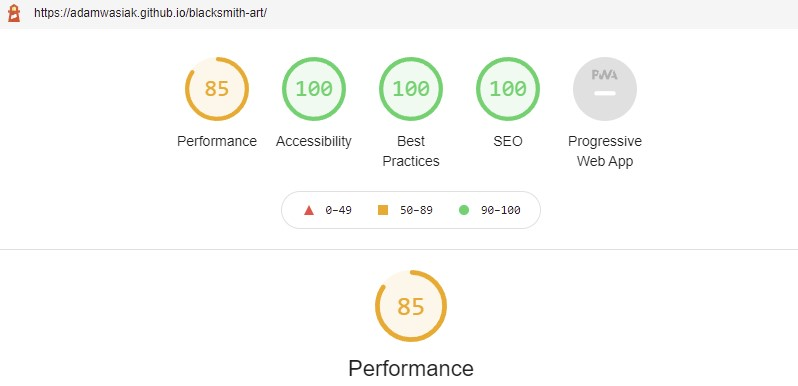

# Blacksmith Art by Jan Wasiak
Website dedicated to a local blacksmith artist and his work.
For art and blacksmithing lovers.

Please visit the website in [here](https://adamwasiak.github.io/blacksmith-art/)

## Milestone Project 1
### Purpose 
The website was created for the purpose of completing the first Milestone Project for the Code Institute's Diploma in Software Development (E-commerce Applications). The website was built using the knowledge gained from the HTML and CSS Modules in the course.
The target audience for this website are users interested in blacksmith related art and who may be looking to engage with the artist for commercial purposes. 
The key purpose of the website is to showcase some of the work completed by the artist and provide basis for promotion of work in the web and opportunities to engage with potential clients.

## User Experience Design  

The key objective of the website from user experience perspective was to keep the website simple in terms of its structure and navigation. 
The focus was on keeping the wesbite more visual with limited text content limited to key information about the artist.

### First time visitor goals
- Get to know the artist 
-	Have an opportunity to review some of work completed by the artists
-	Visit social media platforms for further engagement, including commercial one
-	Opportunity to engage with the artist for specific order through the Contact Me form 

### Returning visitor goals
-	Opportunity to check for updated work gallery 
-	Opportunity to engage with the artist for specific order through the Contact Me form or via Social media platforms via links

## Website design 
The website consists of 3 pages, homepage, my work (gallery) and contact form page. Each of the pages contains links to the remaining 2 pages of the website, through the navigation links placed in the top right corner of the screen.

-**Concept** the key concept was to create a simple, eye pleasing website, with a well-balanced contrasts and color.

-**Colors** and background- the colors are primarily grey and light grey in terms of fonts and background.

-**Typography** – I have selected font “Dancing Script” with sans-serif as a fall-back font for logo and welcome message on the website. The specific font of “Dancing Script” was sourced from Google Fonts library.

## Features 
### Home Page

The navigation bar consists of a logo “Blacksmith Art by Jan Wasiak” and Home, My Work and Contact me link to respective pages. The logo itself functions as a home button and bring the users back to the home page.

**Main Section**

The main section contains a welcome message styled with the “Dancing Script” font. The purpose of the message is to welcome user on the website and through the font provide sense of artistic nature of the content.
Subsequent sections, within the main section of the homepage, contain brief information on the artist, his workshop and his vision for his work.

**Footer**

The footer features simple icons linking users to real and active Instagram and Etsy accounts. Facebook icon takes users to Facebook’s landing page. Each icon will open respective external website in new window in line with industry standards.

### My Work 

This page of the website features set of images reflecting artist’s work. The idea of this section of the website was to keep it simple as a gallery with a set of aligned images.

### Contact me

This section of the website allows users to engage with the artist directly through a contact form. The contact form allows for a message to be included, apart from the core details of the user such as Name, Surname and Email address. All of the sections of the contact form are validated for contacted, including the email address section, which is validated for format of the information and to ensure that an actual email is being submitted. The contact me page styles the background with thyme related image.

## Future developments
Whilst the initial concept was to keep the website simple and focused on its visual content, there is several future developments to enhance user experience and provide an additional value for the artist.
The key features include:

1.	Artist’s local language version of the website 
2.	Additional section to share pictures and details of products available 
3.	Feature allowing users to submit orders for products available
4.	Routing of contact messages from the websites directly into artist’s personal email address
5.	My work and home page content to align into columns for users using smaller devices for enhanced user experience.

## Testing 
Throughout the course of testing the following key test areas were focused on:

**Functional**

-Each of the pages (Home, My Work and Contact me) were tested to ensure that the nav bar links work. This included testing of the logo (Blacksmith Art by Jan Wasiak) to ensure that it brought users back to the home page. 

-Each of the pages (Home, My Work and Contact me) were tested to confirm that the social media links take users to correct external websites and that each opened a new widow, in line with industry standards.

Functional testing was deemed to be completed successfully.

**Responsive user experience**

-Testing completed for responsive design for the following break points 1200px, 1024px,768px and for mobile at 320px.

-My Work and Contact pages had the most optimal responsiveness to all device sizes. During testing an observation was made that the image contact of My Work page can be restyled into column for smaller devices in order to enhance user experience. This observation was included in the future features section above.

-Testing for responsiveness was completed in Chrome Dev Tool and whilst in the tool the responsiveness of all 3 pages was successfully tested, actual testing on Ipad Mini device highlighted a potential bug. On Ipad Mini header image seems to be missing. 
Testing on mobile device (Samsung A21s) highlighted a bug related to homepage, where the users could not click on the nav bar menu links due to overlapping header image. This bug was fixed prior to final project submission.

Responsiveness testing highlighted additional work required to improve the user experience in terms of website’s overall responsiveness, more specifically homepage.

**Code validator testing**

The code itself was validated using HTML - W3C HTML Validator and CSS - Jigsaw CSS Validator.
Results have been outlined below

**Index file**

**My work**

**Contact me**

**CSS file**

**Lighthouse – Dev Tools**

*Desktop*

*Mobile*

**Bugs**

  **Fixed Bugs**
  
  -In the latter part of the project there were some bugs fixed related to responsive design, specifically homepage layout for various resolutions.
  
  -Specific bug impacting (smart) mobile users was fixed prior to project submission. The bug impacted homepage for the (smart) mobile users, preventing users from using nav bar    links to other sections of the page. (Home, My Work and Contact me).
  
  **Unfixed Busg**
  
  -Ipad Mini bug identified during device testing remains unfixed at the time of the project submission. The bug seems to impact visibility of the header image on the homepage.
  
  -There are potential opportunities to further enhancement of overall responsive design, specifically for the homepage section.
 
### Deployment 
This project was created and worked using Code Institute Gitpod Full Template. Once the website was created it was deployed using GitHub.  The specific steps for the deployment were as follows:

1. Go to the repository of the project, once in GitHub
2. Go to settings
3. Go to GitHub Pages
4. Select the source branch as “main” and folder as “root” and click Save.
5. After few minutes the website was confirmed as published with the following user link: https://adamwasiak.github.io/blacksmith-art/

### Credits

-Contact me background photo credit Jonny Gios - https://unsplash.com/photos/uVmVzxYNQUg

-Header image -credit to paasadani- https://pixabay.com/illustrations/anvil-3d-metal-forge-heavy-3588498/

-Header image- credit to Devanath- https://pixabay.com/photos/horseshoe-hoof-magnet-metal-6282055/

-Submit button styling -credit to W3 School 

Thanky you to Code Institute for excellent module content, Code Institue support team and my mentor Daisy for guidance and support.

